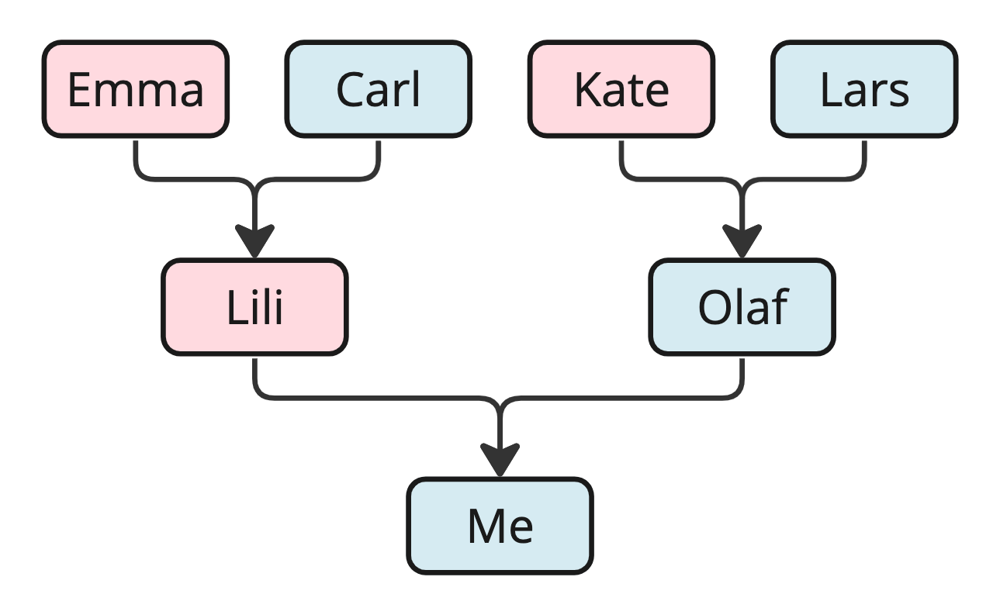

- [1.1 - Konsep Dasar Struktur Data dan Algoritma](#11---konsep-dasar-struktur-data-dan-algoritma)
  - [1.1.1 - Pengertian](#111---pengertian)
  - [1.1.2 - Fungsi Struktur Data dan Algoritma](#112---fungsi-struktur-data-dan-algoritma)
  - [1.1.3 - Perbedaan SDA dan Konsep Pemograman](#113---perbedaan-sda-dan-konsep-pemograman)
  - [1.1.4 - Teori Struktur Data dan Algoritma](#114---teori-struktur-data-dan-algoritma)
  - [1.1.5 - Implementasi Struktur Data dan Algoritma](#115---implementasi-struktur-data-dan-algoritma)

## 1.1 - Konsep Dasar Struktur Data dan Algoritma
### 1.1.1 - Pengertian
1. **Struktur Data**
   
   Struktur Data adalah mekanisme atau cara yang digunakan untuk mengelola data agar dapat diakses dan dimanipulasi secara efektif dan efisien. Struktur Data membantu kita untuk mengelola data dengan jumlah besar, mengurangi kompleksitas algoritma, dan meningkatkan efisiensi algoritma. 
   
   Jenis-jenis dari Struktur Data dalam pemograman yaitu:
   - Array
   - Linked list 
   - Tree
   - List
   - Stack
   - Queue

   **Ilustrasi**
   
   Struktur data dapat diilustrasikan dengan pohon keluarga. Pembuatan struktur data anggota keluarga dalam bentuk pohon keluarga memudahkan pembacaan informasi terkait hubungan keluarga tiap anggota keluarga.
2. **Algoritma**
   
   Algoritma adalah kumpulan langkah-langkah perintah yang digunakan untuk mendapatkan solusi dari permasalahan yang diberikan. Algoritma yang efisien dapat membantu kita menemukan solusi dari permasalahan secara efektif dan efisien.

   Adapun implementasi dari Algoritma dalam pemograman yaitu:
   - Algoritma mencari rute tercepat di dalam sistem navigasi GPS
   - Algortima *searching* untuk mencari suatu data
   - Algoritma untuk melakukan pengurutan atau *sorting*
3. **Struktur Data dan Algoritma**
   Struktur Data dan Algoritma saling berhubungan antara satu dengan yang lain. Algoritma diimplementasikan di Struktur Data. Dan Struktur Data dapat diakses atau diolah dengan Algoritma.
### 1.1.2 - Fungsi Struktur Data dan Algoritma
- Membuat program yang dapat berjalan dengan efektif dan efisien baik diperhitungan berdasarkan waktu yang digunakan maupun memory yang dibutuhkan
- Mengelola data dengan jumlah yang besar (*big data*) dengan efektif dan efisien seperti *search engine*
- Mencari rute terpendek dari posisi A ke posisi yang lain seperti sistem GPS
- Menyelesaikan permasalahan kompleks dengan pendekatan sistematis
### 1.1.3 - Perbedaan SDA dan Konsep Pemograman
- Struktur Data dan Algortima mempelajari bagaimana agar data dapat disimpan, diorganisasi, dan diakses secara efisien serta bagaimana algoritma dapat bekerja untuk menyelesaikan masalah. Contoh struktur data yaitu Array, Linked List, Stack, Queue, Tree, dan Graph. Sedangkan contoh algoritma yaitu Sorting, Searching, dan lain-lain.
- Konsep pemograman mempelajari bagaimana menulis program, seperti bagaimana menulis sintaks, logika, dan paradigma pemrograman. Paradigma pemograman yaitu seperti procedural, OOP, functional, sintaks, semantik.
### 1.1.4 - Teori Struktur Data dan Algoritma
| Teori | Penjelasan |
| --------- | ------- |
| Array | Struktur data untuk menyimpan elemen-elemen |
| Linked List | Kumpulan node yang dihubungkan secara bersamaan di mana setiap node menuju ke alamat memori dari node berikutnya |
| Stack | Struktur data yang menyimpan data seperti tumpukan buku (menerapkan konsep LIFO) |
| Queue | Struktur data |
| Time Complexity | Waktu yang dibutuhkan untuk menjalankan algoritma |
| Searching Algorithm | Algoritma untuk mencari suatu elemen di dalam kumpulan elemen |
| Sorting Algorithm | Algoritma untuk mengurutkan elemen-elemen secara *descending* ataupun *ascending* di dalam suatu kumpulan elemen |
| Graph | Struktur data yang berisi *vertices* (node) dan *edges* yang membentuk *cycle* |
| Tree | Struktur data yang berisi *vertices* (node) dan *edges* yang tidak membentuk *cycle* dan memiliki tingkat hierarki |
| Shortest Path | Algoritma untuk mencari jarak terpendek dari node ke node yang lain |
| Minimum Spanning Tree | Algoritma untuk mencari kombinasi jarak terpendek untuk menghubungkan semua node |
### 1.1.5 - Implementasi Struktur Data dan Algoritma
Adapun implementasi dari materi struktur data dan algoritma dapat ditemukan pada bidang berikut:
- Operating Systems
- Database Systems
- Web Applications
- Machine Learning
- Video Games
- Cryptographic Systems
- Data Analysis
- Search Engines
