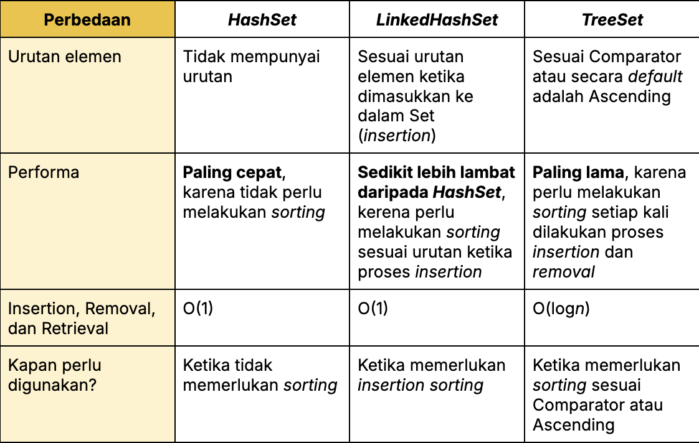

# 4.1 - Set

- [4.1 - Set](#31---set)
  - [📑 Penjelasan](#-penjelasan)
  - [✏️ Deklarasi](#️-deklarasi)
  - [⚙️ Operasi](#️-operasi)
    - [Insertion](#insertion)
    - [Access](#access)
    - [Removal](#removal)
    - [Iteration](#iteration)
  - [📚 Referensi](#-referensi)


## 📑 Penjelasan

Set (atau **himpunan**) adalah konsep struktur data yang mirip dengan himpunan dalam matematika, di mana setiap elemen hanya muncul satu kali, tetapi dalam jumlah elemen yang terbatas. Adapun **tujuan** dari penggunaan Set dalam struktur data yaitu:
- Menyimpan elemen secara unik
- Menghilangkan duplikat
- Memeriksa apakah sebuah elemen ada atau tidak

Di Java, `Set` adalah bagian dari **Java Collections Framework** dan merepresentasikan kumpulan elemen tanpa urutan tertentu serta tidak mengizinkan elemen duplikat. Java menyediakan beberapa implementasi `Set` yang sering digunakan:



Untuk menggunakan `Set`, kita perlu mengimpor paket `java.util`.

## ✏️ Deklarasi

Sebagai contoh:
```java
import java.util.HashSet;
import java.util.Set;

Set<Integer> favNumbers = new HashSet<>();
```

Mendeklarasikan himpunan `fav_numbers` dengan tipe anggota elemen berupa `Integer`.

## ⚙️ Operasi

### Insertion

Memasukkan elemen angka `36` ke dalam himpunan `fav_numbers`:
```java
fav_numbers.add(36);
```

### Access

Mengecek apakah angka `36` ada dalam himpunan `fav_numbers`:
```java
if (favNumbers.contains(36)) {
    System.out.println("Angka 36 merupakan salah satu angka favorit saya");
}
```

### Removal

Menghapus keanggotaan angka `36` dari himpunan `fav_numbers`:
```java
favNumbers.remove(36);
```

### Iteration

Iterasi seluruh anggota elemen pada himpunan `fav_numbers`:
```java
for (int number : favNumbers) {
    System.out.println("Angka favorit: " + number);
}
```

Atau menggunakan Iterator:
```java
import java.util.Iterator;

Iterator<Integer> iterator = favNumbers.iterator();
while (iterator.hasNext()) {
    System.out.println("Angka favorit: " + iterator.next());
}

```

## 📚 Referensi

- [Java Set](https://docs.oracle.com/javase/8/docs/api/java/util/Set.html)
- [Perbedaan HashSet, LinkedHashSet, dan TreeSet](https://javaconceptoftheday.com/hashset-vs-linkedhashset-vs-treeset-in-java/)
