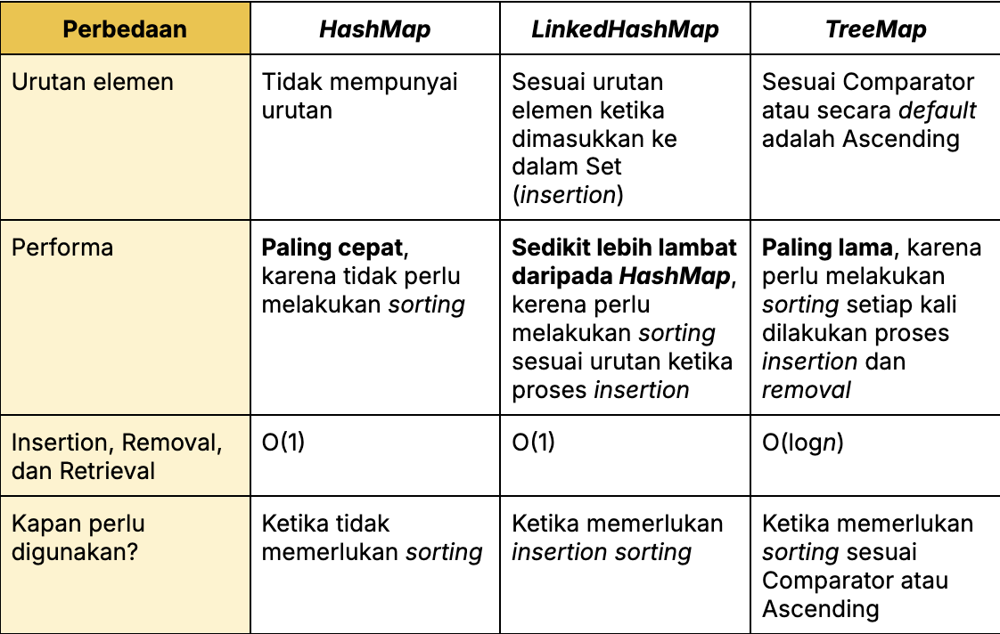

# 4.2 - Map
- [4.2 - Map](#42---map)
  - [📑 Penjelasan](#-penjelasan)
  - [✏️ Deklarasi](#️-deklarasi)
  - [⚙️ Operasi](#️-operasi)
    - [Assignment](#assignment)
    - [Access](#access)
    - [Removal](#removal)
    - [Iteration](#iteration)
  - [📚 Referensi](#-referensi)


## 📑 Penjelasan

Map (atau **pemetaan**) adalah struktur data yang menyimpan pasangan key (kunci) dan **value** (nilai). Setiap **key** bersifat unik dan digunakan untuk mengakses **value** yang terkait padanya. 

Map sangat berguna karena memungkinkan kita untuk mengambil data dengan **key** daripada menggunakan indeks angka seperti pada array. Dengan cara ini, pengaksesan data lebih mudah dan fleksibel. 

Dalam Java, `Map` adalah bagian dari **Java Collections Framework** dan sering digunakan untuk mengasosiasikan suatu objek dengan objek lainnya — mirip dengan ***dictionary*** atau **array asosiatif** di bahasa pemrograman lain.

Java menyediakan beberapa implementasi `Map` yang sering digunakan:


Untuk menggunakan `Map`, kita perlu mengimpor paket `java.util`.

## ✏️ Deklarasi

Mendeklarasikan `Map` yang memetakan `String` ke objek `Mahasiswa`:
```java
import java.util.HashMap;
import java.util.Map;

class Mahasiswa {
    String nama;
    String prodi;
    int angkatan;
}

Map<String, Mahasiswa> dataMhs = new HashMap<>();
// Map<[key], [value]> [variabel] = new HashMap<>();
```

## ⚙️ Operasi

### Assignment
Menambahkan data mahasiswa dengan key "M0525025" ke dalam `dataMhs`:
```java
Mahasiswa mhs = new Mahasiswa();
mhs.nama = "Bella Aster Kevia";
mhs.prodi = "Informatika";
mhs.angkatan = 2025;
dataMhs.put("M0525025", mhs);
```

### Access

Mengambil data mahasiswa dengan key "M0525025":
```java
Mahasiswa savedMhs = dataMhs.get("M0525025");
System.out.println("Nama     : " + savedMhs.nama);
System.out.println("Prodi    : " + savedMhs.prodi);
System.out.println("Angkatan : " + savedMhs.angkatan);
```

Mengubah data mahasiswa dengan key "M0525025":
```java
dataMhs.get("M0525025").nama = "Bella";

// Atau menggunakan variabel referensi
Mahasiswa mhs = dataMhs.get("M0525025");
mhs.nama = "Bella";
```

Mengecek apakah mahasiswa dengan key "M0525025" ada dalam `dataMhs`:
```java
if (dataMhs.containsKey("M0525025")) {
    System.out.println("M0525025 merupakan mahasiswa UNS");
} else {
    System.out.println("M0525025 bukan mahasiswa UNS");
}
```

### Removal

Menghapus **M0525025** dari `dataMhs`:
```java
dataMhs.remove("M0525025");
```

### Iteration

Iterasi seluruh elemen dataMhs menggunakan enhanced for loop:
```java
    for (Map.Entry<String, Mahasiswa> entry : dataMhs.entrySet()) {
        String nim = entry.getKey();
        Mahasiswa mhs = entry.getValue();

        System.out.println("NIM      : " + nim);
        System.out.println("Nama     : " + mhs.nama);
        System.out.println("Prodi    : " + mhs.prodi);
        System.out.println("Angkatan : " + mhs.angkatan);
        System.out.println("------------------------");
    }
```

Atau menggunakan iterator:
```java
import java.util.Iterator;

    Iterator<Map.Entry<String, Mahasiswa>> iterator = dataMhs.entrySet().iterator();
    while (iterator.hasNext()) {
        Map.Entry<String, Mahasiswa> entry = iterator.next();
        
        String nim = entry.getKey();
        String nama = entry.getValue().nama;
        
        System.out.println(nim + " : " + nama);
    }
```

## 📚 Referensi

- [Java Map](https://docs.oracle.com/javase/8/docs/api/java/util/Map.html)
- [Perbedaan HashMap, LinkedHashMap, dan TreeMap](https://medium.com/@AlexanderObregon/exploring-the-world-of-java-maps-hashmap-linkedhashmap-and-treemap-6c12297063f6)
