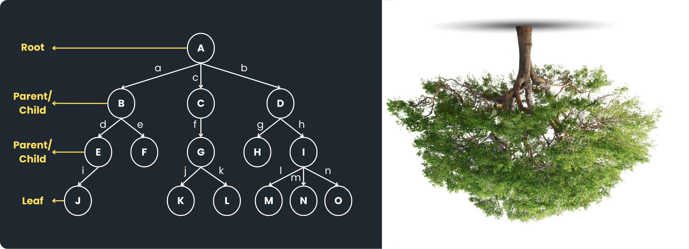

# 5 - Tree
## Definition
Tree merupakan konsep Struktur Data non-linear di mana data-data di dalamnya saling berhubungan (*linked*) dan disusun secara hierarki (bertingkat). Tree biasanya digunakan untuk menyimpan data yang memiliki hubungan secara hierarki antara satu dengan yang lainnya. Tree mengambil konsep dari sebuah pohon yang terbalik dengan ilustrasi sebagai berikut:


<hr>

### Terminologi
Tree tersusun atas *node-node* yang dapat dikategorikan sebagai *root node*, *parent node*, *child node*, dan *leaf*. Adapun penjelasan dari beberapa terminologi-terminologi lain pada tree yaitu:
- **Node**, merupakan data yang dihubungkan. Pada ilustrasi di atas, contoh *node* yaitu A, B, C, D, ... dan P
- **Edge**, merupakan hubungan di antara *node*. Pada ilustrasi di atas, contoh *edge* yaitu a, b, c, d, ... dan n
- **Root Node**, merupakan *node* pertama atau *node* paling atas dari sebuah *tree*. Pada ilustrasi di atas, *root node* merupakan *node* A
- **Parent Node**, adalah semua *node* yang memiliki *child node*. Pada ilustrasi di atas, *parent node* yaitu *node* A, B, C, D, E, F, G, H, dan I
- **Child Node**, adalah semua *node* yang dimiliki oleh *parent node*. Pada konsep *tree*, *child node* tidak dibatasi jumlahnya. Contoh *child node* pada ilustrasi di atas yaitu *node* B, C, D, E, F, G, H, I, K, L, M, N, O, dan P
- **Leaf Node**, adalah semua *node* yang tidak memiliki *child node* (berada di paling bawah). Pada ilustrasi di atas *leaf node* yaitu *node* K, L, M, N, O, dan P
- **Sub Tree**, adalah sebagian *tree* yang lebih kecil yang berada di dalam *tree* yang lebih besar. Contoh *sub tree* pada ilustrasi di atas yaitu *tree* dari *node* B, E, F, dan K.
- **Size Tree**, adalah jumlah semua *node* di dalam *tree*. Pada ilustrasi di atas, *size tree*-nya yaitu 15
- **Height of Tree**, adalah ketinggian *tree* dihitung dari *leaf node* hingga *root node*. *Height of Tree* juga dapat diketahui dengan menghitung panjang *edge* dari *leaf node* hingga *root node*. Pada ilustrasi di atas, *height of tree*-nya yaitu 3
- **Depth of Tree**, adalah kedalaman *tree* dihitung dari *root node* hingga *leaf node*. *Depth of Tree* juga dapat diketahui dengan menghitung panjang *edge* dari *root node* hingga *leaf node*. Pada ilustrasi di atas, *depth of tree*-nya yaitu 3

### Perbedaan dengan Struktur Data yang Lain
- Perbedaan *tree* dengan ***list*** yaitu *tree* disusun secara bertingkat-tingkat (hierarki) sedangkan *list* disusun secara lurus (linear)
- Perbedaan *tree* dengan ***graph*** yaitu struktur *tree* tidak membentuk *cycle* sedangkan *graph* membentuk *cycle*

## Kenapa menggunakan Tree?
- *Tree* mampu melakukan porses *insertion* dan *deletion* data dengan efisien karena menggunakan konsep *list*
- *Tree* digunakan untuk menyimpan dan mengorganisasi data secara **hierarkial** (bertingkat)
- *Tree* dapat digunakan untuk memudahkan dalam **proses *searching*** dengan cepat. Contoh Binary Search Tree dengan kompleksitas wakti O(log *n*)
- *Tree* dapat digunakan untuk memudahkan **proses *sorting***. Contoh proses pengaksesan *In-Order* pada Binary Search Tree
- Konsep *Tree* biasanya digunakan pada proses penyimpanan data yang besar (*big data*) seperti File Explorer, Database, DNS, dan HTML DOM (Documment Object Model)

## Contoh Kasus
### 1. Sistem Perpustakaan UNS


### 2. File Explorer
```
├── Applications
│   ├── Hades.app
│   │   └── Contents
│   │       ├── Info.plist
│   │       ├── MacOS
│   │       │   └── run.sh
│   │       └── Resources
│   │           └── shortcut.icns
│   ├── INSIDE.app
│   │   └── Contents
│   │       ├── Info.plist
│   │       ├── MacOS
│   │       │   └── run.sh
│   │       └── Resources
│   │           └── shortcut.icns
│   ├── Stardew Valley.app
│   │   └── Contents
│   │       ├── Info.plist
│   │       ├── MacOS
│   │       │   └── run.sh
│   │       └── Resources
│   │           └── shortcut.icns
...
```

### 3. DOM HTML


## Implementasi
> **Note**: Dalam bahasa Java, terdapat Library untuk struktur data *tree* yaitu *TreeModel*. Namun pada praktikum ini, **kita akan membuat *tree* kita sendiri dari awal**.

img>

Terdapat tiga method utama dalam membuat *tree*. Ketiga *method* tersebut yaitu *insert*, *remove*, dan *traversal* (mengakses *node*). Dalam membuat *tree* dengan bahasa Java, kalian dapat mengikuti langkah-langkah berikut:
### 1. Membuat Class Node
```java
class Node {
    int data;   // tipe data bebas, berfungsi untuk menyimpan data
}
```
>**Note:** Class Node digunakan untuk membuat *object* Node dengan atribut utama yaitu **data**.

### 2. Membuat Constructor Node pada Class Node
```java
class Node {
    int data;   // tipe data bebas, berfungsi untuk menyimpan data

    // Cunstructor
    // berfungsi untuk memudahkan proses pembuatan object Node
    Node(int data){
        this.data = data;   // agar value 'data' sebagai argumen dapat dimasukkan ke dalam 'data' pada object
    }
}
```
>**Note:** Constructor berfungsi untuk memudahkan pembuatan *object* dari *class* Node.

### 3. Membuat Class Tree
```java
class Tree {
    Node root;  // membuat variabel 'root' sebagai root pada tree
}
```
>**Note:** Variabel 'root' merupakan *object* dari class Node. Variabel ini hanya dideklarasikan tetapi belum dibuat sebagai *object*

### 3. Membuat Method Insert()
```java
class Tree {
    Node root;  // membuat variabel 'root' sebagai root pada tree

    public void insert(int data){
    }
}
```
>**Note:** Method ini tidak mengembalikan nilai apa apa (void) karena method ini memodifikasi Node 'root' dengan menambahkan *node-node* lain ke dalam Node 'root' untuk membentuk *tree* yang berasal dari Node 'root'. Method *insert()* mengambil parameter data (dengan tipe data yang sesuai kebutuhan).

### 4. Membuat If-Else Condition pada Method Insert
```java
class Tree {
    Node root;  // membuat variabel 'root' sebagai root pada tree

    public void insert(int data){
        if (root == null) {         // jika tree belum memiliki root
            root = new Node(data);
        } else {
            root.data = data;       // memasukkan argumen 'data' ke dalam object root
        }
    }
}
```
>**Note:** Jika *tree* belum memiliki *root*, maka akan dibuat dulu *root*-nya. Jika *tree* sudah memiliki *root*, method *insert()* maka akan menambahkan data/*node* ke dalam *root*.

### 3. Membuat Method Remove()
```java

```

### Sintaks
Not: Ada library Tree, tapi gausa dipake
### Cara Mengkases
1. Pre-Order
2. In-Order
3. Post-Order
