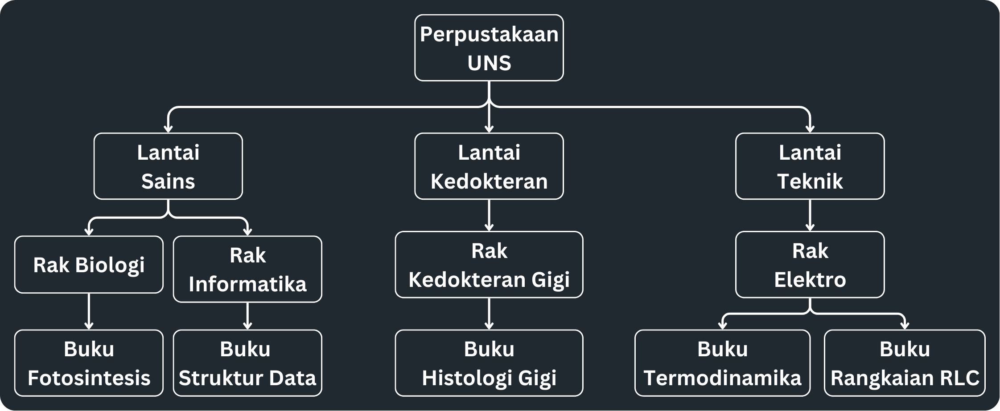

# 5 - Tree
## Definition
Tree merupakan konsep Struktur Data non-linear di mana data-data di dalamnya saling berhubungan (*linked*) dan disusun secara hierarki (bertingkat). Tree biasanya digunakan untuk menyimpan data yang memiliki hubungan secara hierarki antara satu dengan yang lainnya. Tree mengambil konsep dari sebuah pohon yang terbalik dengan ilustrasi sebagai berikut:

    
    

### Terminologi
Tree tersusun atas *node-node* yang dapat dikategorikan sebagai *root node*, *parent node*, *child node*, dan *leaf*. Adapun penjelasan dari beberapa terminologi-terminologi lain pada tree yaitu:
- **Root Node**, merupakan *node* pertama atau *node* paling atas dari sebuah *tree*.

### Perbedaan dengan Struktur Data yang Lain
## Kenapa Tree?
## Contoh Kasus
## Implementasi
### Sintaks
Not: Ada library Tree, tapi gausa dipake
### Cara Mengkases
1. Pre-Order
2. In-Order
3. Post-Order
