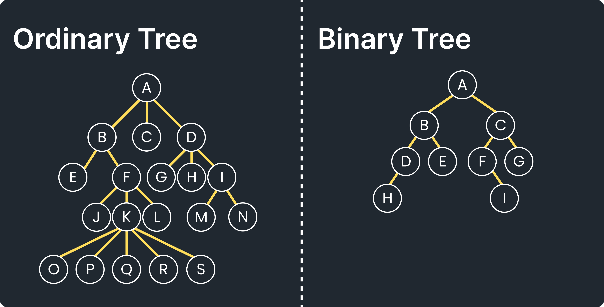
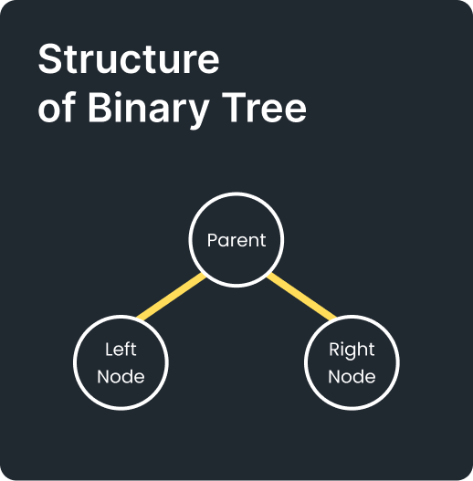

# Binary Tree

- [Binary Tree](#binary-tree)
  - [Overview](#overview)
    - [Konsep Tree](#konsep-tree)
    - [Perbedaan Tree dan Binary Tree](#perbedaan-tree-dan-binary-tree)
  - [Pengertian](#pengertian)
  - [Kenapa Menggunakan Binary Tree](#kenapa-menggunakan-binary-tree)
  - [Kekurangan](#kekurangan)
  - [Solusi dari Kekurangan](#solusi-dari-kekurangan)
  - [Contoh](#contoh)
  - [Implementasi](#implementasi)


## Overview
### Konsep Tree

<hr>

### Perbedaan Tree dan Binary Tree


## Pengertian
Tree yang memiliki children node dengan jumlah maksimal dua buah di mana node-node di dalam tree tidak memiliki urutan antara satu dengan yang lain. Children node dibedakan menjadi left child dan right child. Jika node tidak memiliki anak atau child maka node itu disebut daun (leaf)



## Kenapa Menggunakan Binary Tree
- Memiliki sintaks *insertion*, *deletion*, dan *searching* yang lebih simple daripada *tree*.
- Menjadi landasan untuk algoritma **Binary Search Tree**, **AVL Tree** dan, **RB Tree**

## Kekurangan
- Tidak memperdulikan urutan
- Belum bisa melakukan *sorting*
- Kecepatan operasi *insert*, *delete*, dan pencarian atau pengaksesan elemen adalah O(n), karena untuk menemukan posisi elemen yang dicari diperlukan iterasi dengan menelusuri semua *node* elemen di dalam *tree*

## Solusi dari Kekurangan
- Dibuatlah konsep Binary Search Tree

## Contoh
- Digunakan pada teori bahasa automata (bahasa komputer) untuk membentuk *parse tree* (grammar) dan *expression tree* (aritmatika)
- Digunakan untuk pembuatan program yang memerlukan penyimpanan data secara hierarki tapi tidak terikat dengan kemampuan pengurutan
- Digunakan pada konsep algoritma **Binary Search Tree**, **AVL Tree** dan, **RB Tree**

## Implementasi
```java
import java.util.LinkedList;
import java.util.Queue;

class Node {
    int value;
    Node left, right;

    Node(int value) {
        this.value = value;
    }
}

class BinaryTree {
    Node root;

    // Tambah node secara level-order
    void add(int value) {
        Node newNode = new Node(value);
        if (root == null) {
            root = newNode;
            return;
        }

        Queue<Node> queue = new LinkedList<>();
        queue.add(root);

        while (!queue.isEmpty()) {
            Node curr = queue.poll();

            if (curr.left == null) {
                curr.left = newNode;
                return;
            } else {
                queue.add(curr.left);
            }

            if (curr.right == null) {
                curr.right = newNode;
                return;
            } else {
                queue.add(curr.right);
            }
        }
    }

    // InOrder Traversal
    void inOrder(Node node) {
        if (node != null) {
            inOrder(node.left);
            System.out.print(node.value + " ");
            inOrder(node.right);
        }
    }

    // PreOrder Traversal
    void preOrder(Node node) {
        if (node != null) {
            System.out.print(node.value + " ");
            preOrder(node.left);
            preOrder(node.right);
        }
    }

    // PostOrder Traversal
    void postOrder(Node node) {
        if (node != null) {
            postOrder(node.left);
            postOrder(node.right);
            System.out.print(node.value + " ");
        }
    }

    // Search (BFS)
    boolean contains(int target) {
        if (root == null) return false;

        Queue<Node> queue = new LinkedList<>();
        queue.add(root);

        while (!queue.isEmpty()) {
            Node curr = queue.poll();
            if (curr.value == target) return true;

            if (curr.left != null) queue.add(curr.left);
            if (curr.right != null) queue.add(curr.right);
        }

        return false;
    }

    // Delete node by value
    void delete(int value) {
        if (root == null) return;

        if (root.left == null && root.right == null) {
            if (root.value == value) root = null;
            return;
        }

        Queue<Node> queue = new LinkedList<>();
        queue.add(root);

        Node target = null, last = null;

        while (!queue.isEmpty()) {
            last = queue.poll();

            if (last.value == value) target = last;

            if (last.left != null) queue.add(last.left);
            if (last.right != null) queue.add(last.right);
        }

        if (target != null) {
            target.value = last.value;
            deleteDeepest(last);
        }
    }

    // Hapus node terdalam
    void deleteDeepest(Node delNode) {
        Queue<Node> queue = new LinkedList<>();
        queue.add(root);

        while (!queue.isEmpty()) {
            Node curr = queue.poll();

            if (curr.left != null) {
                if (curr.left == delNode) {
                    curr.left = null;
                    return;
                } else queue.add(curr.left);
            }

            if (curr.right != null) {
                if (curr.right == delNode) {
                    curr.right = null;
                    return;
                } else queue.add(curr.right);
            }
        }
    }

    // Print semua traversal
    void printAll() {
        System.out.print("InOrder: ");
        inOrder(root);
        System.out.println();

        System.out.print("PreOrder: ");
        preOrder(root);
        System.out.println();

        System.out.print("PostOrder: ");
        postOrder(root);
        System.out.println();
    }
}

public class BabBinaryTree {
    public static void main(String[] args) {
        BinaryTree tree = new BinaryTree();

        tree.add(7);
        tree.add(4);
        tree.add(9);
        tree.add(1);
        tree.add(5);

        tree.printAll();

        System.out.println("Cari 5? " + tree.contains(5));
        System.out.println("Cari 10? " + tree.contains(10));

        System.out.println("Hapus 4...");
        tree.delete(4);
        tree.printAll();
    }
}

```

