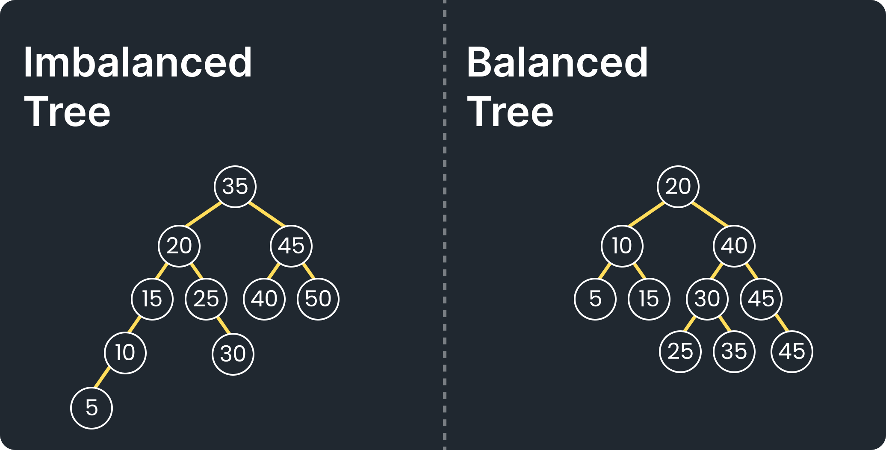

# Binary Search Tree
- [Binary Search Tree](#binary-search-tree)
  - [Pengertian](#pengertian)
  - [Kelebihan](#kelebihan)
  - [Kekurangan](#kekurangan)
  - [Solusi dari Kekurangan](#solusi-dari-kekurangan)
  - [Contoh](#contoh)
  - [Implementasi](#implementasi)


## Pengertian
Binary Search Tree merupakan konsep Binary Tree yang memiliki aturan bahwa left child memiliki value yang lebih kecil daripada parent node-nya sedangkan right child memiliki value yang lebih besar daripada parent node-nya. Hal ini menyebabkan tree memiliki struktur data yang berurutan.


## Kelebihan
- Mampu melakukan *sorting*
- Karena memiliki kemampuan *sorting*, proses operasi *insertion, deletion*, dan *searching* bisa dilakukan dengan lebih cepat
- Menjadi landasan untuk konsep algoritma **AVL Tree** dan **Red Black Tree**
## Kekurangan

- Tidak memiliki aturan yang mengikat terkait keseimbangan *tree* sehingga ada kemungkinan terbentuk *imbalanced tree* (*tree* yang tidak seimbang antara subtree kiri dan kanannya)
- *Imbalanced tree* cenderung lebih lambat daripada *balanced tree* untuk proses operasi *insertion*, *deletion*, dan *searching* karena ada kemungkinan langkah/jarak yang ditempuh lebih banyak daripada *balanced tree*
- *Imbalanced tree* memiliki kompleksitas waktu O(n)
## Solusi dari Kekurangan
- Dibuatlah konsep *self balancing tree* seperti **AVL Tree** dan **Red Black Tree** sehingga proses operasi memiliki kompleksitas waktu O(log n)
## Contoh
- Algoritma sorting
- Decision tree
- Program pencarian kata di dalam kamus
## Implementasi
```java
class Node {
    int value;
    Node left, right;

    Node(int value) {
        this.value = value;
        left = right = null;
    }
}

class BinarySearchTree {
    Node root;

    // Tambah data
    Node insert(Node node, int value) {
        if (node == null) return new Node(value);
        if (value < node.value)
            node.left = insert(node.left, value);
        else if (value > node.value)
            node.right = insert(node.right, value);
        return node;
    }

    void insert(int value) {
        root = insert(root, value);
    }

    // Cari data
    boolean search(Node node, int key) {
        if (node == null) return false;
        if (node.value == key) return true;
        if (key < node.value)
            return search(node.left, key);
        else
            return search(node.right, key);
    }

    boolean search(int key) {
        return search(root, key);
    }

    // Hapus data
    Node delete(Node node, int key) {
        if (node == null) return null;

        if (key < node.value)
            node.left = delete(node.left, key);
        else if (key > node.value)
            node.right = delete(node.right, key);
        else {
            // Kasus 1 dan 2
            if (node.left == null)
                return node.right;
            else if (node.right == null)
                return node.left;

            // Kasus 3 - dua anak
            node.value = minValue(node.right);
            node.right = delete(node.right, node.value);
        }

        return node;
    }

    void delete(int key) {
        root = delete(root, key);
    }

    int minValue(Node node) {
        int min = node.value;
        while (node.left != null) {
            min = node.left.value;
            node = node.left;
        }
        return min;
    }

    // InOrder traversal (kiri, root, kanan)
    void inOrder(Node node) {
        if (node != null) {
            inOrder(node.left);
            System.out.print(node.value + " ");
            inOrder(node.right);
        }
    }

    void printInOrder() {
        System.out.print("InOrder: ");
        inOrder(root);
        System.out.println();
    }

    // PreOrder traversal (root, kiri, kanan)
    void preOrder(Node node) {
        if (node != null) {
            System.out.print(node.value + " ");
            preOrder(node.left);
            preOrder(node.right);
        }
    }

    void printPreOrder() {
        System.out.print("PreOrder: ");
        preOrder(root);
        System.out.println();
    }

    // PostOrder traversal (kiri, kanan, root)
    void postOrder(Node node) {
        if (node != null) {
            postOrder(node.left);
            postOrder(node.right);
            System.out.print(node.value + " ");
        }
    }

    void printPostOrder() {
        System.out.print("PostOrder: ");
        postOrder(root);
        System.out.println();
    }
}


public class BabBST {
    public static void main(String[] args) {
        BinarySearchTree bst = new BinarySearchTree();

        // Tambahkan data
        bst.insert(50);
        bst.insert(30);
        bst.insert(70);
        bst.insert(20);
        bst.insert(40);


        // Tampilkan isi BST
        bst.printInOrder();
        bst.printPreOrder();
        bst.printPostOrder();

        bst.insert(14);
        bst.insert(73);

        System.out.println("Setelah data ditambahkan");
        bst.printInOrder();

        // Cari data
        System.out.println("Apakah 60 ada? " + bst.search(60));
        System.out.println("Apakah 25 ada? " + bst.search(25));

        // Hapus data
        System.out.println("Hapus 30...");
        bst.delete(30);
        bst.printInOrder();
    }
}
```
