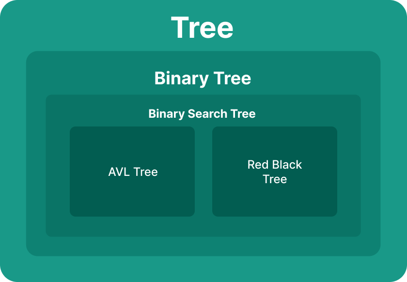
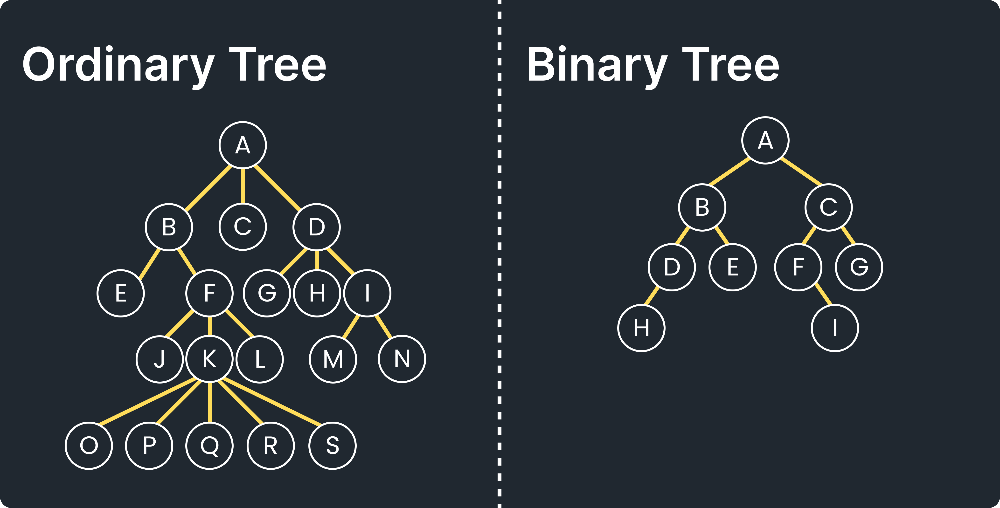
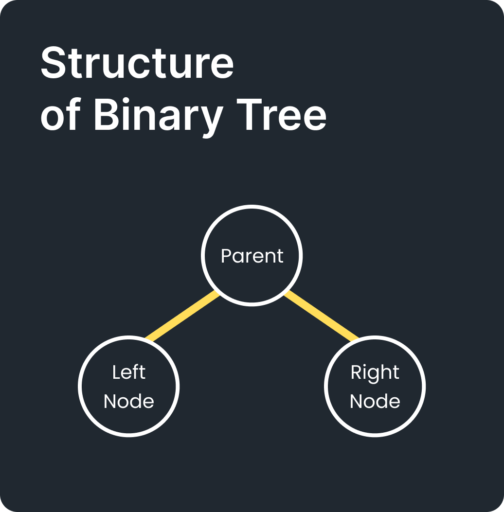

# Binary Tree

- [Binary Tree](#binary-tree)
  - [Overview](#overview)
    - [Konsep Tree](#konsep-tree)
    - [Perbedaan Tree dan Binary Tree](#perbedaan-tree-dan-binary-tree)
  - [Pengertian](#pengertian)
  - [Kenapa Menggunakan Binary Tree](#kenapa-menggunakan-binary-tree)
  - [Kekurangan](#kekurangan)
  - [Solusi dari Kekurangan](#solusi-dari-kekurangan)
  - [Contoh](#contoh)
  - [Implementasi](#implementasi)


## Overview
### Konsep Tree

<hr>

### Perbedaan Tree dan Binary Tree


## Pengertian
Tree yang memiliki children node dengan jumlah maksimal dua buah di mana node-node di dalam tree tidak memiliki urutan antara satu dengan yang lain. Children node dibedakan menjadi left child dan right child. Jika node tidak memiliki anak atau child maka node itu disebut daun (leaf)



## Kenapa Menggunakan Binary Tree
- Memiliki sintaks *insertion*, *deletion*, dan *searching* yang lebih simple daripada *tree*.
- Menjadi landasan untuk algoritma **Binary Search Tree**, **AVL Tree** dan, **RB Tree**

## Kekurangan
- Tidak memperdulikan urutan
- Belum bisa melakukan *sorting*
- Kecepatan operasi *insert*, *delete*, dan pencarian atau pengaksesan elemen adalah O(n), karena untuk menemukan posisi elemen yang dicari diperlukan iterasi dengan menelusuri semua *node* elemen di dalam *tree*

## Solusi dari Kekurangan
- Dibuatlah konsep Binary Search Tree

## Contoh
- Digunakan pada teori bahasa automata (bahasa komputer) untuk membentuk *parse tree* (grammar) dan *expression tree* (aritmatika)
- Digunakan untuk pembuatan program yang memerlukan penyimpanan data secara hierarki tapi tidak terikat dengan kemampuan pengurutan
- Digunakan pada konsep algoritma **Binary Search Tree**, **AVL Tree** dan, **RB Tree**

## Implementasi
```java
class Node {
    int value;
    Node left, right;

    Node(int value) {
        this.value = value;
        left = right = null;
    }
}

class BinaryTree {
    Node root;

    // Menambahkan data (insert)
    Node insert(Node root, int value) {
        if (root == null) {
            return new Node(value);
        }

        if (value < root.value) {
            root.left = insert(root.left, value);
        } else {
            root.right = insert(root.right, value);
        }

        return root;
    }

    void add(int value) {
        root = insert(root, value);
    }

    // Traversal - InOrder (kiri - root - kanan)
    void inOrder(Node root) {
        if (root != null) {
            inOrder(root.left);
            System.out.print(root.value + " ");
            inOrder(root.right);
        }
    }

    // Traversal - PreOrder (root - kiri - kanan)
    void preOrder(Node root) {
        if (root != null) {
            System.out.print(root.value + " ");
            preOrder(root.left);
            preOrder(root.right);
        }
    }

    //Traversal - PostOrder (kiri - kanan - root)
    void postOrder(Node root) {
        if (root != null) {
            postOrder(root.left);
            postOrder(root.right);
            System.out.print(root.value + " ");
        }
    }

    // Cari elemen
    boolean search(Node root, int target) {
        if (root == null) return false;
        if (root.value == target) return true;
        if (target < root.value)
            return search(root.left, target);
        else
            return search(root.right, target);
    }

    // Hapus elemen
    Node delete(Node root, int value) {
        if (root == null) return null;

        if (value < root.value) {
            root.left = delete(root.left, value);
        } else if (value > root.value) {
            root.right = delete(root.right, value);
        } else {

            // node dengan 1 anak atau tidak ada anak
            if (root.left == null) return root.right;
            else if (root.right == null) return root.left;

            // node dengan 2 anak
            root.value = minValue(root.right);
            root.right = delete(root.right, root.value);
        }
        return root;
    }

    int minValue(Node root) {
        int min = root.value;
        while (root.left != null) {
            min = root.left.value;
            root = root.left;
        }
        return min;
    }

    // Fungsi bantu
    void printInOrder() {
        System.out.print("InOrder Traversal: ");
        inOrder(root);
        System.out.println();
    }

    void printPreOrder() {
        System.out.print("PreOrder Traversal: ");
        preOrder(root);
        System.out.println();
    }

    void printPostOrder() {
        System.out.print("PostOrder Traversal: ");
        postOrder(root);
        System.out.println();
    }

    boolean contains(int value) {
        return search(root, value);
    }

    void remove(int value) {
        root = delete(root, value);
    }
}

// Main program
public class BabBinaryTree {
    public static void main(String[] args) {
        //Inisialisai objek tree
        BinaryTree tree = new BinaryTree();

        // Tambahkan data
        tree.add(7);
        tree.add(4);
        tree.add(9);
        tree.add(1);
        tree.add(5);

        // Tampilkan traversal
        tree.printInOrder();
        tree.printPreOrder();
        tree.printPostOrder();

        // Cari data
        System.out.println("Cari 5? " + tree.contains(5));  
        System.out.println("Cari 10? " + tree.contains(10));

        // Hapus data
        tree.remove(4);
        tree.printInOrder();  
    }
}

```

