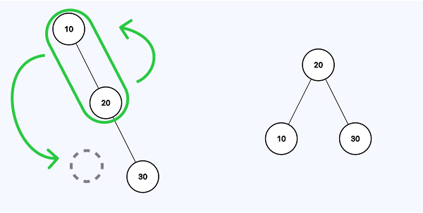
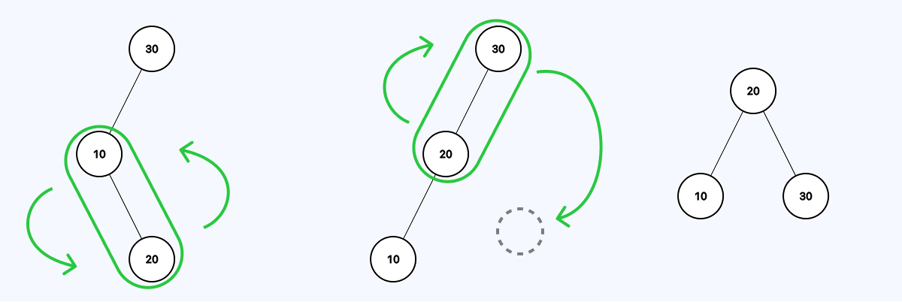
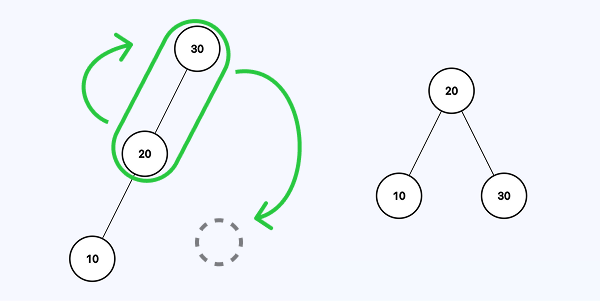
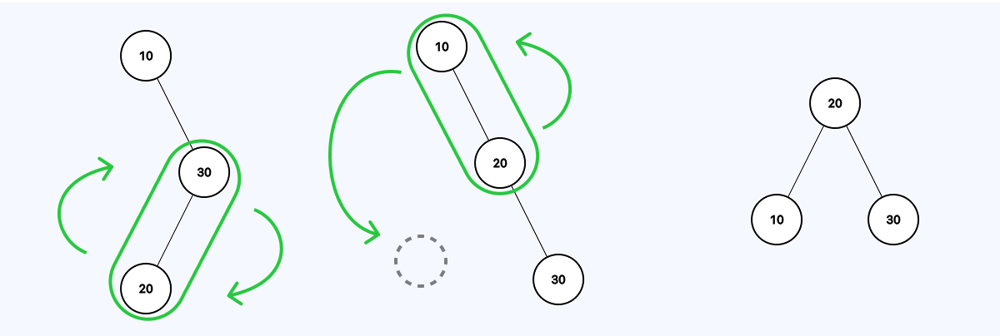
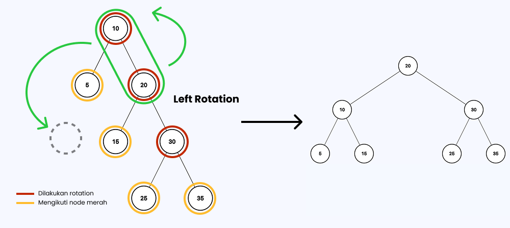
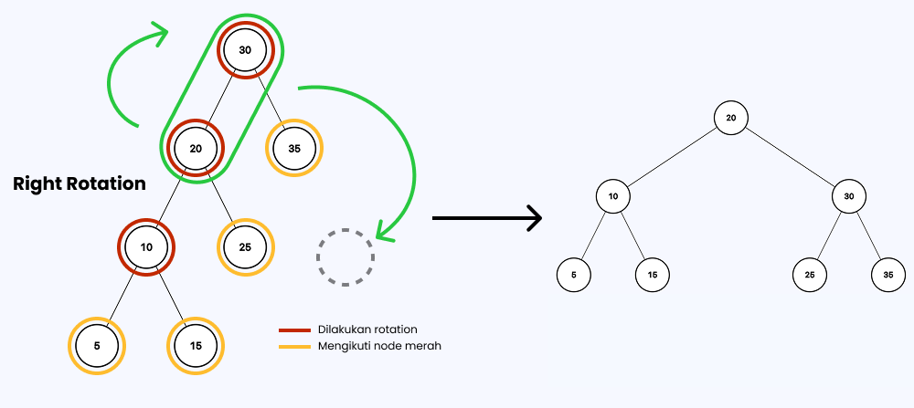
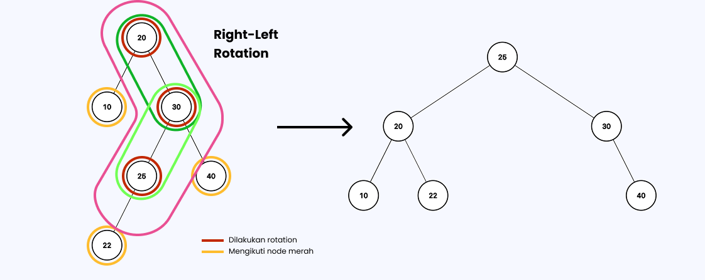

# Rotation
Algoritma rotasi digunakan pada AVL Tree dan Red Black Tree. Pada kedua *tree*, algoritma rotasi adalah sama. Namun terdapat perbedaan antara kapan harus terjadi rotasi.

## Perbedaan Kapan Waktu Rotasi
### AVL Tree
- Ketika terdapat selisih ketinggian yang **bernilai {-2, 2}**
- Dilakukan pada *node* yang **memiliki tanda *balance factor* yang sama** (negatif-negatif, positi-positif) 
### Red Black Tree
- Ketika pada proses pemeriksaan *uncle node* ditemukan *uncle node* bernilai **null** atau **berwarna hitam**
- Dilakukan pada **grandparent node dan parent node**

## Algoritma
### Basic
#### Left Rotation

#### Left-Right Rotation

#### Right Rotation

#### Right-Left Rotation

### Special Case
#### Left-Left Rotation

#### Right-Right Rotation

#### Right-Left Special Rotation

## Referensi
[Youtube](https://www.youtube.com/watch?v=jDM6_TnYIqE&t=1892s)
