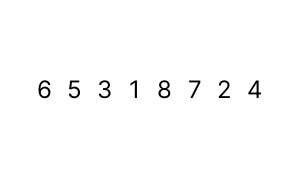

# 🫧 Bubble Sort 🫧
- [🫧 Bubble Sort 🫧](#-bubble-sort-)
  - [Pengertian](#pengertian)
  - [Mekanik ⚙️](#mekanik-️)
  - [Kelebihan](#kelebihan)
  - [Kekurangan](#kekurangan)
  - [Implementasi](#implementasi)

## Pengertian
Bubble Sort adalah *sorting algorithm* yang memeriksa apakah dua elemen yang berdekatan sudah berada di urutan yang tepat. 
>Jika tidak berada diurutan yang benar, maka akan dilakukan ***switching***. 

>Jika berada diurutan yang benar, maka akan memeriksa elemen selanjutnya. 

Proses pemeriksaan akan dilakukan secara berulang-ulang dari elemen paling awal hingga elemen paling akhir. Hal ini memungkinkan semua elemen-elemen terurut di urutan yang tepat.

## Mekanik ⚙️



1. Membandingkan elemen dari kiri ke elemen tepat setelahnya:
   - Jika berada diurutan yang benar maka akan lanjut memeriksa elemen selanjutnya
   - Jika **tidak** berada diurutan yang benar, maka akan melakukan ***switching***
        > **SWITCHING**:
        > 1. Membandingkan dari kiri ke elemen tepat setelahnya
        > 2. Memasukan elemen-kiri (elemen bernilai lebih besar) ke variabel *temp* (tempat untuk menampung elemen sementara/temporary)
        > 3. Memindahkan elemen-kanan (elemen bernilai lebih kecil) ke kiri
        > 4. Mengembalikan elemen yang berada di variabel *temp* ke tempat elemen-kanan sebelumnya
2. Memeriksa elemen tepat selanjutnya
3. Melakukan langkah 1 dan 2 berulang kali sehingga tersusun baris elemen yang urut
> **NOTE** : Notice kalau tiap kali iterasi akan membawa elemen terbesar ke sebelah kanan

## Kelebihan
- Algoritma yang sederhana
- Cocok untuk program berskala kecil sederhana
- Cocok untuk data yang sudah hampir urut
- Space efficient (hanya memerlukan ruang penyimpanan tambahan untuk menyimpan variabel sementara)
  
## Kekurangan
- Memiliki kompleksitas waktu n²
    > Didapat dari iterasi sebanyak (n-1) yang dilakukan sebanyak n kali juga
    >
    > = (n-1)n
    >
    > = n²
- Tidak coock untuk dataset yang banyak

## Implementasi
```java
public class BubbleSort {
    static void BubbleSorting(int array[]) {
        int size = array.length;
        for (int i = 0; i < size - 1; i++) {
            for (int j = 0; j < size - i - 1; j++) {
                // Ascending
                if (array[j] > array[j+1]) {
                    int temp = array[j];
                    array[j] = array[j+1];
                    array[j + 1] = temp;
                }
            }
        }
    }
    public static void main(String[] args) {
        int array[] = {9,1,8,2,7,3,6,4,5};

        BubbleSorting(array);

        for (int i = 0; i < array.length; i++) {
            System.out.println(array[i]);
        }
    
    }
}
```