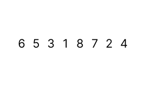

# Insertion Sort
- [Insertion Sort](#insertion-sort)
  - [Pengertian](#pengertian)
  - [Mekanik ⚙️](#mekanik-️)
  - [Kelebihan](#kelebihan)
  - [Kekurangan](#kekurangan)
  - [Implementasi](#implementasi)

## Pengertian
Isertion Sort adalah algoritma *sorting* yang memeriksa apakah semua elemen di sebelah lebih kecil daripada elemen tersebut.
>Jika terdapat elemen yang lebih besar, maka akan dilakukan ***switching*** hingga tidak ada elemen lagi yang lebih kecil di sebelah kiri elemen tersebut. 

>Jika tidak ditemukan elemen yang lebih besar, maka akan melanjutkan ke elemen berikutnya. 

Proses pemeriksaan akan dilakukan secara berulang-ulang dari elemen paling awal hingga elemen paling akhir. Hal ini memungkinkan semua elemen-elemen terurut di urutan yang tepat.
## Mekanik ⚙️



1. Mengambil elemen dari kiri
2. Memeriksa sebelah kiri elemen yang dipilih
   - Jika terdapat elemen yang lebih besar, maka akan dilakukan ***switching***
   - Jika tidak ditemukan elemen yang lebih besar, maka akan melanjutkan ke elemen berikutnya
        > **SWITCHING**:
        > 1. Membandingkan elemen dengan elemen-elemen yang berada sebelah kiri elemen tersebut
        > 2. Memasukan elemen tersebut ke variabel *temp* (tempat untuk menampung elemen sementara/temporary) 
        > 3. Menggeser elemen-kiri yang lebih besar tersebut ke kanan
        > 4. Memasukan kembali elemen yang berada di variabel *temp* ke tempat kosong barisan elemen (tempat elemen yang lebih besar tersebut sebelumnya)
3. Memeriksa elemen selanjutnya
4. Melakukan langkah 1, 2, dan 3 berulang kali sehingga tersusun baris elemen yang urut
> **NOTE** : Notice kalau elemen sebelah kiri pasti bernilai lebih kecil setelah dilakukan iterasi

## Kelebihan
- Algoritma yang sederhana
- Cocok untuk program berskala kecil sederhana
- Cocok untuk data yang sudah hampir urut
- Space efficient (hanya memerlukan ruang penyimpanan tambahan untuk menyimpan variabel sementara)
  
## Kekurangan
- Memiliki kompleksitas waktu n²
- Kurang cocok untuk mengurutkan data secara *descending* (besar ke kecil)
- Tidak cocok untuk dataset yang banyak
## Implementasi 
```java
```