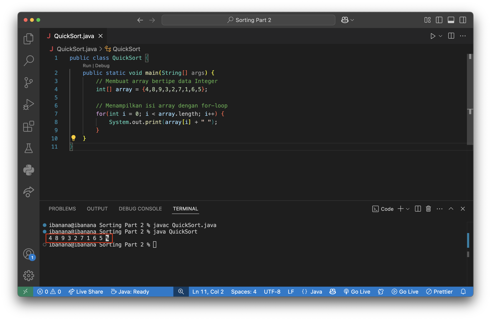
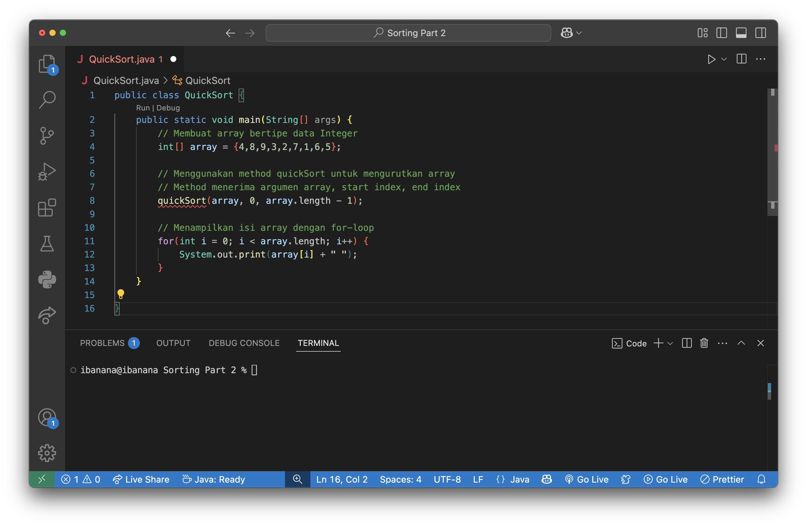
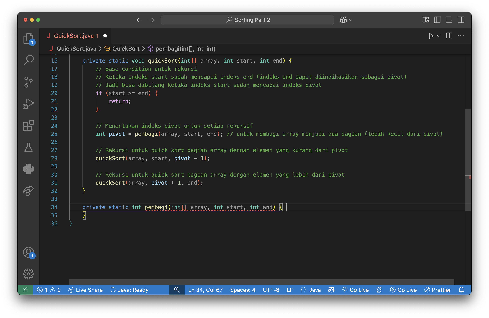
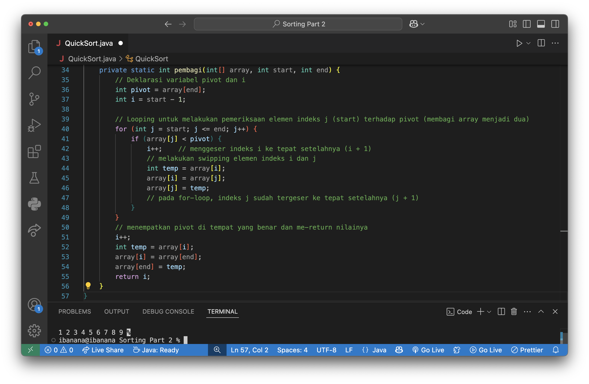

# Quick Sort
- [Quick Sort](#quick-sort)
  - [Pengertian](#pengertian)
  - [Mekanik ⚙️](#mekanik-️)
  - [Kelebihan](#kelebihan)
  - [Kekurangan](#kekurangan)
  - [Implementasi](#implementasi)

## Pengertian
Quick Sort adalah algoritma *sorting* yang memiliki ciri khusus yaitu *sorting* menggunakan ***pivot***. *Pivot* pada Quick Sort digunakan untuk membagi deret bilangan menjadi dua bagian yaitu bagian yang lebih kecil daripada *pivot* dan bagian yang lebih besar daripada *pivot*.

Pada dua bagian tersebut, kemudian dilakukan pengurutan lagi menggunakan Quick Sort sehingga kedua bagian tersebut masing-masing terbagi menjadi dua bagian yang lebih kecil lagi. Proses ini dilakukan secara ***rekursif*** hingga posisi *pivot* terletak di indeks yang benar.

*Pivot* yang sudah ditempatkan di tempat yang benar ini kemudian akan disusun kembali sebagai deret bilangan yang sudah terurutkan.

## Mekanik ⚙️
1. Memilih elemen di dalam Array yang berfungsi sebagai pivot
2. Mendeklarasikan dua indeks yaitu *i* dan *j*
    > Indeks i terletak di tepat sebelum indeks j (start - 1)

    > Indeks j terletak di elemen pertama array (start)
3. Melakukan pemeriksaan tiap elemen di dalam array terhadap *pivot* hingga indeks *j* mencapai indeks *pivot*
   1. Memeriksa apakah nilai indeks *j* lebih besar dari atau sama dengan *pivot*?
        > Jika ***iya***, maka akan menggeser indeks *j* ke tepat setelahnya ***(j + 1)*** dan indeks *i* tetap berada di tempat yang sama
        
        >Jika ***tidak***, maka:
        >1. Menggeser indeks *i* ke tepat setelahnya ***(i + 1)***
        >2. Melakukan *swapping* antara *i* dan *j* 
        >3. Menggeser indeks *j* ke tepat setelahnya ***(j + 1)***
   2. Melakukan pemeriksaan secara berulang hingga indeks *j* mencapai indeks *pivot*
4. Mengulangi langkah ke-1 ke kedua bagian *array* yaitu:
   - Bagian yang lebih kecil daripada *pivot* dan 
   - Bagian *array* yang lebih besar daripada *pivot*

## Kelebihan
- Memiliki average complexity BigO(*n* log(*n*))
- Cocok digunakan untuk dataset yang banyak
- Tidak memerlukan ruang penyimpanan tambahan yang banyak karena algoritma sorting bersifat *in place* sehingga bisa dikatakan **Quick Sort menggunakan ruang penyimpanan secara efektif**
- Quick Sort memungkinkan pengoptimalan algoritma dengan memilih *pivot* yang tepat
  
## Kekurangan
- Memiliki worst case O(n²)
- Karena pemilihan pivot menentukan performa algoritma, maka bisa dikatakan Quick Sort adalah algoritma yang tidak konsisten (bisa menyebabkan worst case)

## Implementasi
1. Membuat array yang akan diurutkan

2. Bagaimana cara mengurutkan array? Menggunakan fungsi *quickSort()*. Fungsi ini menerima argumen *array, start index, dan end index*

3. Membuat algoritma pada fungsi *quickSort()*: 
   1. Menggunakan fungsi *pembagi()* untuk menentukan letak pivot sekaligus membagi array menjadi dua bagian
   2. Melakukan rekursi fungsi *quickSort()* untuk melakukan *sorting* pada *sub array* dengan elemen kurang dari pivot dan *sub array* dengan elemen lebih dari pivot

    >**NOTE:** Fungsi *pembagi()* digunakan untuk membagi array menjadi dua bagian yaitu lebih kecil dari pivot dan lebih besar dari pivot
4. Membuat fungsi *pembagi()* untuk membagi array menjadi dua bagian dan me-*return* index pivot di urutan yang benar (sorted)

Setelah dijalankan, terlihat bahwa array sudah berhasil terurutkan menggunakan algoritma Quick Sort