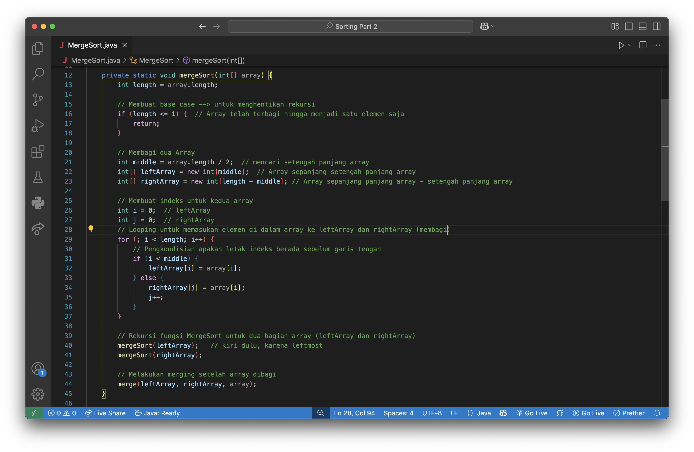

# Merge Sort
- [Merge Sort](#merge-sort)
  - [Pengertian](#pengertian)
  - [Mekanik ⚙️](#mekanik-️)
  - [Kelebihan](#kelebihan)
  - [Kekurangan](#kekurangan)
  - [Implementasi](#implementasi)

## Pengertian
Merge Sort adalah algoritma sorting yang dilakukan dengan membagi elemen-elemen di dalam *array* menjadi dua bagian yang lebih kecil (*array* kanan dan *array* kiri). Proses pembagian dilakukan secara ***rekursif***. 

Setelah dibagi hingga tersisa satu elemen, elemen-elemen tersebut digabungkan kembali sekaligus mengurutkannya berdasarkan value-nya. Proses penggabungan kembali elemen tersebut disebut sebagai ***merge***.

Pada praktiknya, algoritma Merge Sort dilakukan dari branch paling kiri (***leftmost*** *branch*) hingga mencapai elemen paling kiri-bawah dilanjutkan ke branch sebelah kanannya. 
>Pembagian elemen dilakukan dari atas ke bawah 

>*Merging* elemen dilakukan dari bawah ke atas

## Mekanik ⚙️
1. Mencari titik tengah Array
2. Membagi Array bilangan menjadi dua sub Array
3. Memilih sub Array sebelah kiri terlebih dahulu
4. Lakukan pembagian hingga sub Array paling kiri terbagi menjadi sub Array dengan panjang Array n = 1 (hanya tersisa satu elemen)
5. Membangun ulang Array dengan melakukan ***merging*** elemen-elemen Array yang sudah dibagi:
   1. Membandingkan elemen pada sub Array kiri dengan elemen pada sub Array kanan
   2. Masukan elemen yang lebih kecil kembali ke Array
   3. Lakukan pemeriksaan dan insertion pada semua elemen hingga tidak ada elemen yang masih berada di luar Array
6. Mengulangi proses dari langkah pertama pada sub Array yang berada di tepat sebelah kanan sub Array ini
   
## Kelebihan
- Memiliki kompleksitas BigO(*n* log(*n*)) yang konsisten (tidak seperti Quick Sort)
- Cocok digunakan untuk dataset yang banyak
## Kekurangan
- Membutuhkan storage yg lebih banyak daripada *Bubble Sort* dan *Insertion Sort* karena perlu membentuk *sub Array* untuk menyimpan elemen Array yg dibagi
- Ruang penyimpanan yang dibutuhkan yaitu sebesar O(n) (menyesuaikan jumlah elemen di dalam Array)

## Implementasi
1. Membuat array yang akan diurutkan
   
2. Bagaimana cara mengurutkan array tersebut? Untuk mengurutkan array tersebut, dapat menggunakan fungsi *mergeSort()*. Fungsi ini menerima argumen array integer
   
3. Untuk melengkapi fungsi *mergeSort()* diperlukan fungsi tambahan yaitu fungsi *merge()* yang digunakan untuk melakukan proses *merging*. Fungsi ini menerima argumen *leftArray, rightArray, dan array*
   
4. Pada fungi *mergeSort()* akan dibuat algoritma untuk membagi array tersebut menjadi dua bagian hingga array tersebut terbagi menjadi array yang panjangnya *n = 1* (satu elemen). Proses pembagian ini dilakukan secara rekursif. Maka dari itu, diperlukan *base case* sebagai *recursion breaker*/penghenti rekursi
   
5. Adapun algoritma untuk memecah array tersebut yaitu:
   
6. Setelah dipecah menjadi bagian-bagian dengan panjang maksimal *n = 1*, maka akan dilakukan proses *merging* untuk menyusun ulang array sekaligus mengurutkan elemen-elemen dari array tersebut
   
7. Terlihat, ketika program sudah dijalankan, program berhasil mengurutkan array tersebut
   