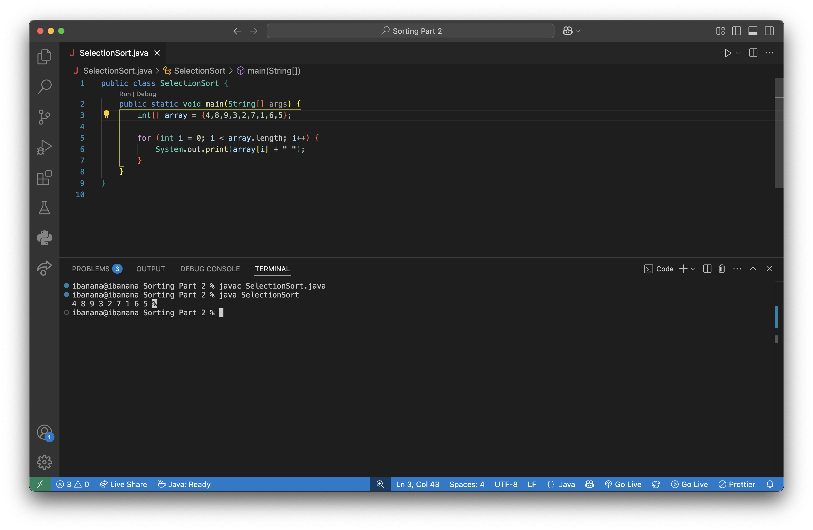
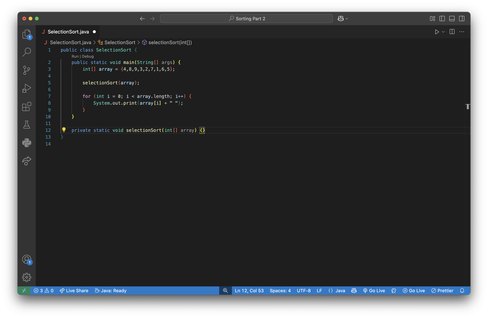
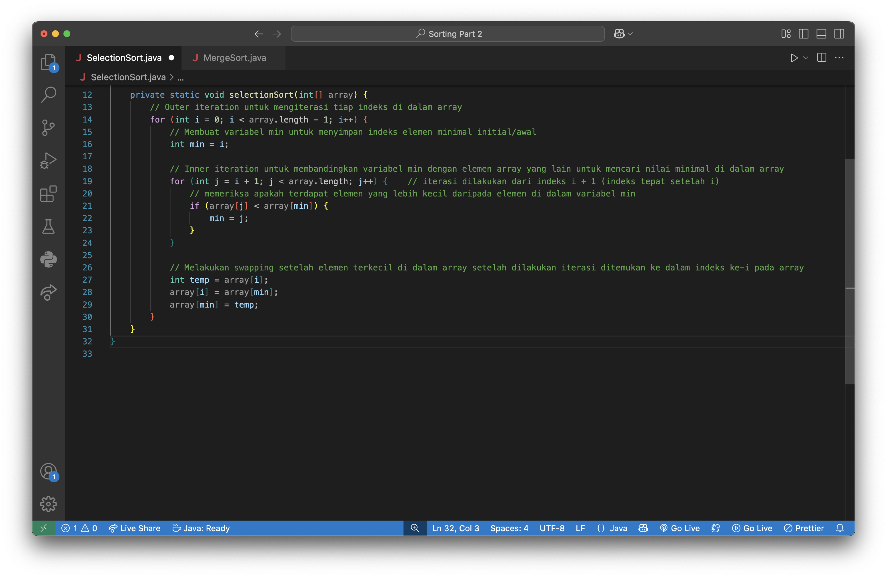
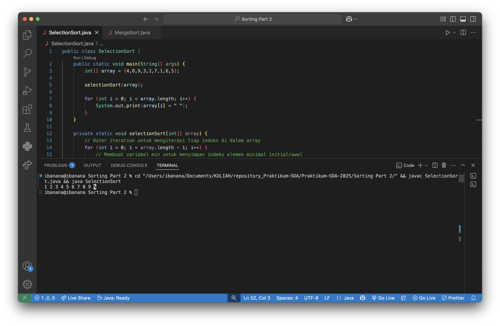

# Selection Sort
- [Selection Sort](#selection-sort)
  - [Pengertian](#pengertian)
  - [Mekanik ⚙️](#mekanik-️)
  - [Kelebihan](#kelebihan)
  - [Kekurangan](#kekurangan)
  - [Implementasi](#implementasi)

## Pengertian
Selection Sort adalah algoritma *sorting* yang dilakukan dengan membandingkan semua elemen di dalam Array untuk dicari nilai ***minimumnya***. Dan setelah ditemukan elemen minimum pada tiap iterasi, akan dilakukan *swapping* untuk meletakan elemen tersebut ke tempatnya. 
>Pada algoritma ini, yang perlu disimpan oleh elemen yaitu *value* dan *indeks* dari elemen tersebut.

## Mekanik ⚙️
1. Pada iterasi untuk indeks ke-1 di dalam Array:
    >**Wadah *min*** berupa variabel → digunakan untuk menyimpan elemen minimum pada suatu iterasi
   1. Mengambil elemen pada indeks pertama, memasukan elemen (*value* dan indeks) pada indeks pertama ke dalam **wadah *min*** (untuk menyimpan nilai minimum)
   2. Membandingkan *value* elemen di dalam **wadah min** dengan semua *value* dari elemen di dalam Array. Jika ditemukan *value* elemen yang lebih kecil, maka elemen (*value* dan indeks) yang berada di dalam **wadah min** akan ditukar dengan elemen (*value* dan indeks) yang lebih kecil tersebut

2. Melakukan *swapping* elemen pada indeks pertama dengan elemen yang berada di dalam **wadah min** menggunakan bantuan variabel temp 
3. Mengulangi iterasi sebanyak n hingga semua elemen dalam Array terurutkan
## Kelebihan
- Simple
- Menggunakan ruang penyimpanan yang sedikit (menambahkan variabel wadah *min* dan variabel *temp*)
- Ruang penyimpanan yang konsisten karena tidak ada penyambahan variabel terlepas jumlah elemen yang bertambah
## Kekurangan
- Memiliki kompleksitas waktu quadratic O(n²) di semua case
- Tidak cocok untuk dataset yang banyak
## Implementasi
1. Membuat array yang akan diurutkan
   
2. Bagaimana cara mengurutkan array tersebut? Untuk mengurutkan array tersebut, dapat digunakan fungsi *selectionSort()*. Fungsi ini menerima arguman *array* dari data integer
   
3. Fungsi *selectionSort()* menggunakan konsep *nested loop*. Di mana *outer loop*-nya berfungsi untuk mengiterasi array dan melakukan *swapping* elemen terkecil. Sedangkan *inner loop*-nya digunakan untuk membandingkan elemen-elemen di dalam array dengan tujuan untuk mencari elemen terkecil pada setiap iterasi *outer loop*-nya
   
4. Adapun ketika program dijalankan, terlihat bahwa program berhasil mengurutkan array yang semula tersusun secara acak
   