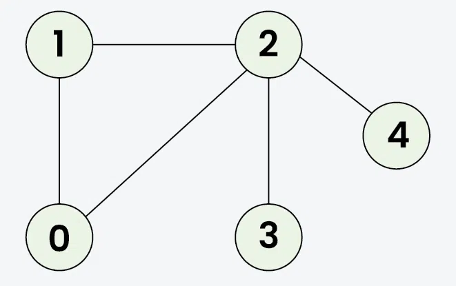

# Graph
## Pengertian
Graph adalah struktur data non linear yang terdiri dari node dan edge yang biasanya digunakan untuk menggambarkan relasi antara node satu dengan node yang lain.

Di dalam penerapannya, graph dapat merepresentasikan masalah di kehidupan nyata yaitu 'permasalahan area' atau network. Adapun beberapa contoh permasalahan area yaitu seperti kabel telepon, kabel rumah, social network, maps, dan lain-lain.

Sebagai contoh dalam permasalahan maps, koordinat kita dan suatu restoran direpresentasikan sebagai node dan jalan raya merupakan edge. Dengan mengetahui dua node dan edge yang menghubungkannya, kita dapat mengetahui jalan penghubung kedua node tersebut yang harus dilewati untuk dapat mencapai resotran dari posisi kita di awal.

## Graph Traversal
Graph tersusun dari node-node yang terhubung dengan edge. Node yang berhubungan tersebut disebut sebagai **Adjacent Node**. Adjacent Node dapat menentukan bagaimana proses traversal berlangsung. Untuk dapat melakukan proses traversal di dalam sebuah graph, dapat dilakukan dengan menggunakan dua metode yaitu Breath First Search (BFS) dan Depth First Search (DFS)

### Breath First Search

> Angka menunjukkan urutan proses traversal
> 
> Output: [0, 1, 2, 3, 4]
#### Algoritma:
1. Memilih initial node (node awal)
2. Memilih semua adjacent node (node yang memiliki relasi dengan initial node)
3. Untuk setiap node yang dipilih, memilih kembali semua adjacent node dari node tersebut yang belum pernah dipilih sebelumnya
4. Melakukan langkah 2-3 hingga semua node dikunjungi

### Depth First Search

> Angka menunjukkan urutan proses traversal
> 
> Output: [0, 1, 2, 3, 4]
#### Algoritma:
1. Memililh initial node (node awal)
   > Misalkan kita memilih node 0
2. Memilih salah satu adjacent node yang belum dipilih (node yang memiliki relasi dengan initial node)  
3. Memasukan induk dari adjacent node yang dipilih ke dalam stack untuk menyimpan posisi traversal
   > Jika tidak ditemukan adjacent node, maka akan dilakukan pop dari stack tersebut untuk melakukan backtracking agar kembali ke node induknya
4. Melakukan langkah 2-3 hingga semua node dikunjungi