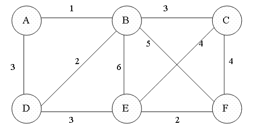

# Minimum Spanning Tree (MST)

## Pengertian
Minimum Spanning Tree adalah algoritma untuk menelusuri semua node di dalam graph dengan total jarak atau edge yang dilewati tersebut adalah total paling minimum. Hasil penelusuran tersebut dapat direpresentasikan dalam bentuk Tree.

Minimum Spanning Tree akan menghasilkan jarak paling efektif yang bisa diperoleh dari hasil penelusuran semua node di dalam graph. Minimum Spanning Tree.

Permasalahan di dunia nyata dapat diselesaikan menggunakan Minimum Spanning Tree ini. Sebagai contoh, untuk mencari panjang kabel minimum agar seluruh rumah terhubung, maka dapat digunakan algoritma MST ini.
## Manfaat
1. Menghubungkan semua node dengan jarak/biaya minimum -> cocok untuk optimasi rute
2. Mencari jarak alternatif
## Kelebihan
1. Menghasilkan hasil yang paling efisien (Greedy)
2. Bisa digunakan dalam graph yang berskala besar
3. Algoritmanya sederhana
## Kekurangan
1. Hanya bekerja untuk graf terhubung
2. Menambah atau menghapus simpul/edge bisa menyebabkan seluruh MST perlu dihitung ulang

# Prim's Algorithm

## Algoritma
1. Memilih initial node
2. Membuat dua set yaitu *visited* (menyimpan node yang sudah dikunjungi) dan *notVisited* (menyimpan node yang belum dikunjungi)
3. Membandingkan semua edge yang menghubungkan *visited* node terluar dengan *notVisited* node lalu memilih edge terkecil
4. Memasukan node yang terhubung dengan edge yang terpilih ke dalam set *visited*
5. Mengulangi proses sampai semua node sudah masuk ke dalam set *visited*

# Kruskal Algorithm

## Algoritma
1. Membuat list dari edge pada graph dan sortir berdasarkan bobotnya terlebih dahulu
2. Mengambil edge dengan bobot terkecil, kemudian cek apakah edge yang diambil membentuk siklus antar node atau tidak
   > Apabila tidak membentuk siklus, maka masukkan edge tersebut ke dalam MST

   > Apabila membentuk siklus, maka buang edge tersebut

3. Ulangi langkah 2 sampai jumlah edge mencapai (V - 1) di mana V merupakan jumlah node keseluruhan dari graph