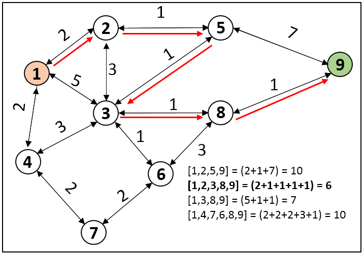

# Dijkstra

## Pengertian
Shortest path adalah permasalahan graph yang mencoba mencari rute yang memiliki total bobot edge terkecil (atau jarak terpendek) antara dua buah node. Algoritma yang biasanya digunakan dalam memecahkan permasalahan shortest path adalah algoritma Dijkstra

## Ciri-Ciri
1. Selalu pilih jalur paling cepat (greedy) -> menghasilkan solusi terbaik
2. Tidak bisa menentukan shortest path untuk value negatif
3. Diterapkan di Google Maps, GPS, Games, dan lain-lain

## Contoh dari Dijkstra yaitu:

Contoh tersebut mencoba mencari rute terpendek dari node 1 ke node 9 dan rute yang dihasilkan adalah 1-2-3-8-9 yang memiliki bobot terkecil (6) di antara opsi rute yang lainnya (7 dan 10)

## Algoritma
1. Mengisi semua node dengan value tak hingga (∞), kecuali node awal/initial yang diisi dengan value 0
2. Memilih node dengan jarak edge terkecil yang belum pernah dikunjungi
3. Melakukan pemeriksaan untuk semua node tetangga:
   1. Hitung jarak edge dari node asal ke node tetangga itu melalui node saat ini
   > Jika jaraknya lebih pendek, maka jarak node tetangga tersebut diperbarui
4. Tandai node tersebut sebagai "sudah dikunjungi"
5. Mengulangi langkah 2-4 hingga semua node dikunjungi
